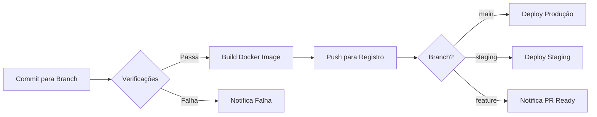

# CI/CD e Deployment - ABF Eventos

## Containerização com Docker

O sistema ABF Eventos é containerizado utilizando Docker, com uma abordagem simples de estágio único. A imagem é baseada em Node.js Alpine 21.7.3, o que proporciona uma imagem leve e segura.

### Dockerfile

O projeto inclui um Dockerfile na raiz que configura a aplicação para ambientes de produção:

```Dockerfile
FROM node:21.7.3-alpine as base

WORKDIR /app

COPY package*.json ./
RUN npm install

COPY . .
COPY .env .

RUN npx prisma generate

RUN npm run build

ENV NODE_ENV=production
ENV PORT=3000

EXPOSE 3000

CMD ["node", "node_modules/.bin/next", "start"]
```

### Scripts de Build e Deploy

O package.json inclui scripts para facilitar a construção e publicação da imagem Docker:

```json
{
  "scripts": {
    "docker:build": "docker build -t andrewjpb/abf-eventos-monolito .",
    "docker:push": "docker push andrewjpb/abf-eventos-monolito"
  }
}
```

## Processo de Deploy Manual

Atualmente, o projeto utiliza um processo de deploy manual com os seguintes passos:

1. Construção da imagem Docker localmente
2. Push da imagem para o DockerHub ou outro registro de contêineres
3. Deploy manual no ambiente de produção

```bash
# Processo de deploy
npm run docker:build
npm run docker:push

# No servidor de produção
docker pull andrewjpb/abf-eventos-monolito
docker stop abf-eventos
docker rm abf-eventos
docker run -d --name abf-eventos \
  -p 3000:3000 \
  --env-file .env \
  --restart always \
  andrewjpb/abf-eventos-monolito
```

## Recomendações para Automação CI/CD

Para aprimorar o processo de CI/CD, recomenda-se implementar:

1. **Workflow de GitHub Actions** para automação de:
   - Verificação de linting e tipos
   - Execução de testes
   - Construção e publicação automática de imagens Docker
   - Deploy automático para ambientes de staging/produção

2. **Proposta de Pipeline**:



3. **Sugestão de GitHub Workflow**:

```yaml
name: CI/CD Pipeline

on:
  push:
    branches: [main, staging]
  pull_request:
    branches: [main, staging]

jobs:
  verify:
    runs-on: ubuntu-latest
    steps:
      - uses: actions/checkout@v3
      - uses: actions/setup-node@v3
        with:
          node-version: '18'
          cache: 'npm'
      - run: npm ci
      - run: npm run lint
      - name: Verificar tipos
        run: tsc --noEmit
      
  build-and-push:
    needs: verify
    if: github.event_name == 'push'
    runs-on: ubuntu-latest
    steps:
      - uses: actions/checkout@v3
      - name: Login to DockerHub
        uses: docker/login-action@v2
        with:
          username: ${{ secrets.DOCKERHUB_USERNAME }}
          password: ${{ secrets.DOCKERHUB_TOKEN }}
      - name: Build and push
        uses: docker/build-push-action@v4
        with:
          push: true
          tags: andrewjpb/abf-eventos-monolito:${{ github.ref == 'refs/heads/main' && 'latest' || 'staging' }}
  
  deploy:
    needs: build-and-push
    runs-on: ubuntu-latest
    steps:
      - name: Deploy to server
        uses: appleboy/ssh-action@master
        with:
          host: ${{ secrets.SERVER_HOST }}
          username: ${{ secrets.SERVER_USERNAME }}
          key: ${{ secrets.SSH_PRIVATE_KEY }}
          script: |
            docker pull andrewjpb/abf-eventos-monolito:${{ github.ref == 'refs/heads/main' && 'latest' || 'staging' }}
            docker stop abf-eventos || true
            docker rm abf-eventos || true
            docker run -d --name abf-eventos \
              -p 3000:3000 \
              --env-file /path/to/.env \
              --restart always \
              andrewjpb/abf-eventos-monolito:${{ github.ref == 'refs/heads/main' && 'latest' || 'staging' }}
```

## Ambientes e Variáveis

| Ambiente | Descrição                                      | Variáveis Específicas                  |
|----------|------------------------------------------------|----------------------------------------|
| Produção | Ambiente final para usuários                   | `NODE_ENV=production`, URLs de produção|
| Staging  | Ambiente de testes pré-produção                | URLs de staging, conexões de teste     |
| Dev      | Ambiente local para desenvolvimento            | `NODE_ENV=development`                 |

## Monitoramento e Logs

Para monitoramento da aplicação em produção, recomenda-se:

1. Implementar integração com sistemas de observabilidade como Sentry ou DataDog
2. Utilizar os logs de aplicação registrados na tabela `AppLog` para auditoria
3. Configurar alarmes para erros críticos e problemas de performance

## Backup e Recuperação

Recomendações para garantir a resiliência da aplicação:

1. Backups diários automatizados do banco de dados PostgreSQL
2. Backup periódico dos arquivos de mídia armazenados no MinIO
3. Documentação de procedimentos de recuperação de desastres
4. Testes regulares de restauração para validar os backups